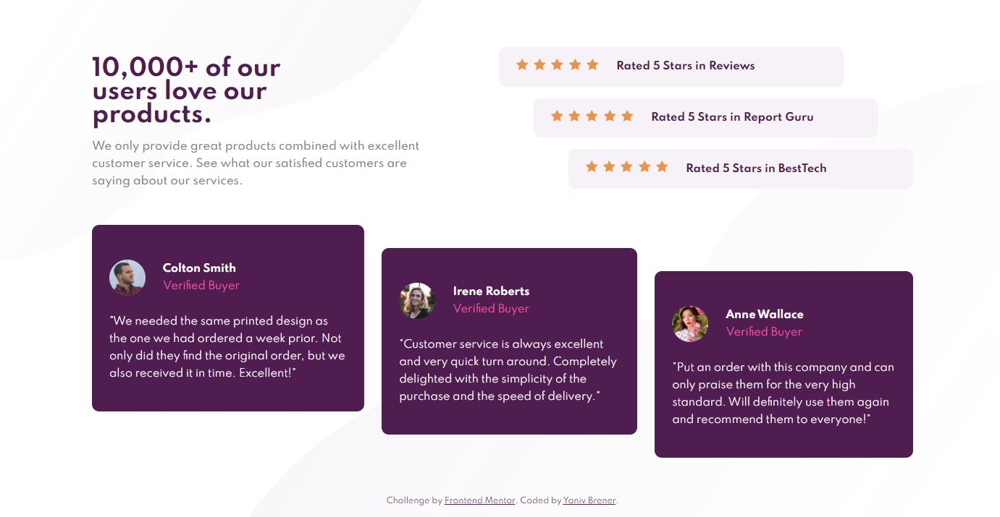

# Frontend Mentor - Social Proof Section solution

## Introduction

This is a solution to the [Social proof section challenge on Frontend Mentor](https://www.frontendmentor.io/challenges/social-proof-section-6e0qTv_bA). Frontend Mentor challenges help you improve your coding skills by building realistic projects.

## Overview

### The challenge

Users should be able to:

- View the optimal layout for the section depending on their device's screen size (assumed two sizes: mobile & desktop)

### Screenshot

### Links

- Solution URL: [My Solution on Frontend Mentor](https://www.frontendmentor.io/solutions/social-proof-challenge-using-scss-flexbox-and-mobilefirst-design-oHnPgiUzJ)
- Live Site URL: [Social Proof hosted on Vercel](https://frontend-mentor-social-proof-ruddy.vercel.app/)

## My process

### Technologies Applied & Skills Learned

- Semantic HTML5 markup
- SCSS (SASS)
- Flexbox
- Mobile-first workflow
